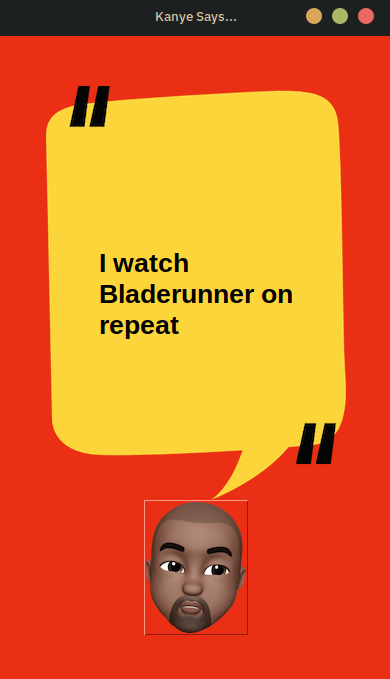

# Kanye Quotes

A simple Python desktop application that displays random Kanye West quotes using the [kanye.rest](https://api.kanye.rest/) API. The app features a graphical user interface built with Tkinter.

## Features

- Fetches and displays a random Kanye West quote.
- Refreshes the quote each time the Kanye button is pressed.
- Stylish UI with custom background and button images.

## Screenshot



## Requirements

- Python 3.x
- `requests` library
- Tkinter (usually included with Python)
- Image assets: `assets/background.png`, `assets/kanye.png`, and `assets/screenshot.png`

## Installation

1. Clone or download this repository.
2. Install the required Python packages:
   ```bash
   pip install -r requirements.txt
   ```
3. Ensure the `assets` folder contains `background.png` and `kanye.png`.

## Usage

Run the application with:

```bash
python main.py
```

A window will appear showing a Kanye West quote. Click the Kanye button to get a new quote.

## Credits

- Quotes provided by [kanye.rest](https://api.kanye.rest/)
- UI built with Python Tkinter

